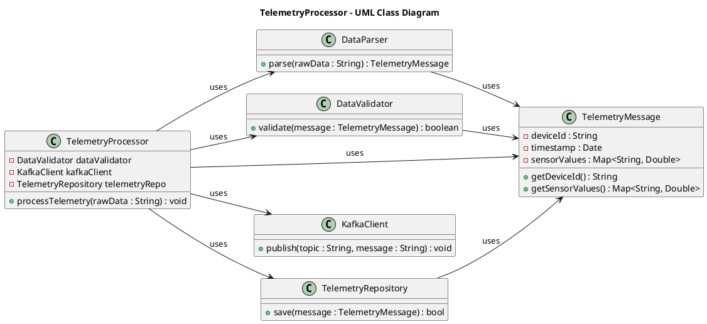
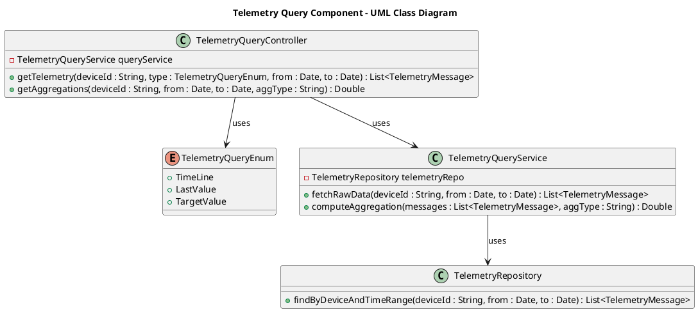
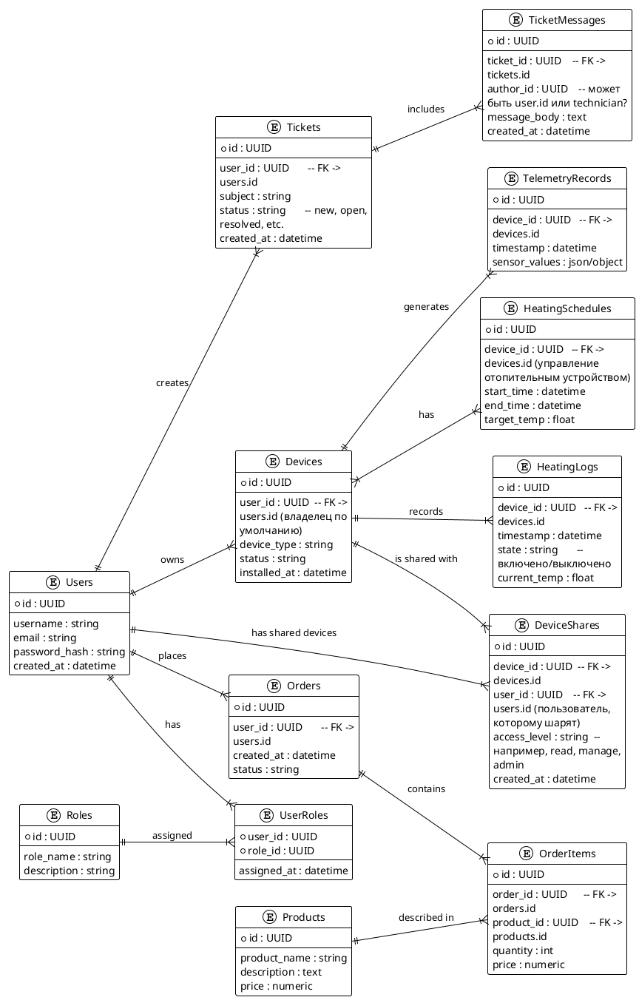

# Project_template

Тип: Материал
Родитель: Описание проекта для 11 когорты (https://www.notion.so/11-03abbbbc8bcb49ed9b85c9b6d1174056?pvs=21)

Это шаблон для решения проектной работы. Структура этого файла повторяет структуру заданий. Заполняйте его по мере работы над решением.

## Задание 1. Анализ и планирование

### 1. Описание функциональности монолитного приложения

#### Управление отоплением

- Пользователи могут удалённо **включать/выключать** отопление в своих домах.
- Система поддерживает **удалённый контроль** работы отопительного оборудования (все команды отправляются централизованно с сервера).
- Состояние отопительной системы (включено/выключено, текущая мощность и т.п.) доступно через веб-интерфейс.

#### Мониторинг температуры

- Пользователи могут **просматривать текущую температуру** в своих домах через веб-интерфейс.
- Система получает данные от **датчиков**, установленных в домах (сейчас их установка осуществляется только специалистом компании).
- Данные о температуре поступают в систему по **синхронному запросу** от сервера к датчику.

### 2. Анализ архитектуры монолитного приложения

- **Язык программирования**: Java
- **База данных**: PostgreSQL
- **Архитектура**: монолитная — все компоненты (веб-интерфейс, бизнес-логика и доступ к данным) находятся в одном приложении.
- **Взаимодействие**: исключительно **синхронное** (каждый запрос обрабатывается последовательно, нет ассинхронных механизмов).
- **Развёртывание**:
  - Требует **остановки** приложения целиком для обновления.
  - Масштабирование возможно только как масштабирование всего приложения целиком.
- **Ограниченная extensibility** (расширяемость): добавление новой функциональности затрагивает весь код монолита.

### 3. Определение доменов и границы контекстов

1. **Домен “Управление устройствами”**  
   - Управление любыми подключаемыми устройствами (реле, датчики, отопительные системы).
   - Логика по включению/отключению, сбору телеметрии, настройке устройств и т.д.

2. **Домен “Мониторинг и телеметрия”**  
   - Ответственен за сбор, хранение и отображение данных от датчиков.
   - Включает модули по агрегации данных, а также логику прогнозирования и аналитики (в будущем).

3. **Домен “Пользовательское управление и аккаунты”**  
   - Все аспекты, связанные с аутентификацией, авторизацией, профилями пользователей.
   - Включает настройки доступа к конкретным устройствам и управление ролями.

4. **Домен “Продажи и поддержка”**  
   - Управляет заказами, модулями и комплектами устройств, которые продаются пользователям.
   - Описывает процессы поддержки — приём заявок, назначение специалистов, консультации.

*(Количество и названия доменов можно варьировать, выделяя именно те области, которые критичны для развития и масштабирования экосистемы.)*

### 4. Проблемы монолитного решения

1. **Ограниченная масштабируемость**  
   - Невозможно независимо масштабировать, например, компонент мониторинга при возрастании числа датчиков.  
   - При возросшей нагрузке приходится поднимать больше ресурсов на весь монолит, что часто неэффективно.

2. **Сложность внесения изменений и развертывания**  
   - Любое обновление требует остановки **всего** приложения, что приводит к простоям и неудобствам для пользователей.  
   - Любые изменения в одной части приложения (например, модуль мониторинга) требуют пересборки и перекомпиляции всего.

3. **Низкая гибкость для быстрой интеграции нового функционала**  
   - При добавлении новых модулей (например, управление освещением или воротами) необходимо расширять код монолита, что существенно усложняет кодовую базу.  
   - Зависимости между компонентами могут приводить к тому, что изменения в одном месте влекут неожиданные последствия в другом.

4. **Затрудненная поддержка и эволюция**  
   - Сложнее организовать команды по доменам: все работают над одним проектом.  
   - Трудно внедрять новые технологии или менять стэк в отдельных компонентах, поскольку всё завязано на общий код и инфраструктуру.

5. **Ограничения для самообслуживания пользователей**  
   - Пользователи не могут самостоятельно добавлять новые устройства: для интеграции требуются изменения в коде и развертывание новой версии приложения.  
   - Монолит не располагает удобными API/механизмами интеграции внешних сервисов и устройств.  

Таким образом, текущее монолитное решение **не масштабируется** и **не приспособлено** к расширяющимся бизнес-задачам компании «Тёплый дом».

### 5. Визуализация контекста системы — диаграмма С4

[Текущее представление монолита (С4)](docs/monolith.puml)

То же в формате `embed`

```plantuml
@startuml
!theme plain
skinparam wrapWidth 200
skinparam maxMessageSize 200
skinparam shadowing false

title "C4 Context Diagram - Монолитное приложение"

!includeurl https://raw.githubusercontent.com/plantuml-stdlib/C4-PlantUML/master/C4_Context.puml

' C4 notation elements:
' Person, System, System_Ext, Relationship, etc.

Person(user, "Пользователь", "Взаимодействует с системой через веб-интерфейс")
Person(technician, "Технический специалист", "Выезжает на объект и подключает систему отопления к монолиту")

System(monolith, "Монолитное приложение", "Java + PostgreSQL", "Все компоненты в одном приложении")

System_Ext(sensor, "Датчик температуры", "Отвечает на синхронные запросы, передаёт данные о температуре")

' Опционально можно явно отобразить базу данных как отдельный элемент.
System_Ext(db, "PostgreSQL", "Хранение данных\r\nЧасть монолита, но для наглядности показана отдельно")

' Взаимосвязи (Relationships)
Rel(user, monolith, "Управление отоплением, просмотр температуры (HTTP/Web)")
Rel(technician, monolith, "Подключение системы отопления в доме")
Rel(technician, sensor, "Настройка системы отопления в доме")

Rel(monolith, sensor, "Синхронные запросы на температуру")
Rel(monolith, db, "CRUD операции")

@enduml
```

## Задание 2. Проектирование микросервисной архитектуры

В этом задании вам нужно предоставить только диаграммы в модели C4. Мы не просим вас отдельно описывать получившиеся микросервисы и то, как вы определили взаимодействия между компонентами To-Be системы. Если вы правильно подготовите диаграммы C4, они и так это покажут.
Поэтапно ныряем в детализацию микросервисов и комопнентов

**Диаграмма контейнеров (Containers)**

```plantuml
@startuml
!theme plain

skinparam wrapWidth 200
skinparam maxMessageSize 200
skinparam shadowing false
top to bottom direction

!include https://raw.githubusercontent.com/plantuml-stdlib/C4-PlantUML/master/C4_Container.puml
!include https://raw.githubusercontent.com/tupadr3/plantuml-icon-font-sprites/master/devicons/postgresql.puml


title C4 Container Diagram – Микросервисная архитектура

' Акторы (внешние пользователи и роли)
Person(user, "Пользователь", "Управляет устройствами и просматривает телеметрию")
Person(technician, "Специалист поддержки", "Отвечает на запросы к техподдержке")


' Внешние системы / устройства
System_Ext(sensors, "Умные датчики", $type="IoT Devices", "Передают данные о температуре и других параметрах")

System_Boundary(system, "Экосистема 'Тёплый дом' (To-Be)") {
  ' API Gateway – единая точка входа во внешние вызовы
  Container(webApp, "Web приложение", "JavaScript", "Предоставляет визуальный интерфейс", $tags="webApp")

  ' API Gateway – единая точка входа во внешние вызовы
  Container(apiGateway, "API Gateway", "Nginx / Kong / etc.", "Распределяет входящие запросы между микросервисами")

  ' Сервисы
  Container(heatingService, "Heating Service", "Java / Spring Boot", "Управление отоплением, включение/выключение, расписания")
  Container(deviceService, "Device Management Service", "Go / Python / etc.", "Регистрация устройств, управление статусами и конфигурациями")
  Container(telemetryService, "Telemetry Service", "Node.js / Python / etc.", "Сбор и хранение данных от датчиков, предоставление телеметрии")
  Container(authService, "Auth Service", "Java / Keycloak / etc.", "Аутентификация, авторизация и управление доступом")
  Container(salesService, "Sales Service", "Ruby on Rails / etc.", "Продажа модульных комплектов")
  Container(supportService, "Support Service", "Python / etc.", "Обработка обращений в техподдержку, управление тикетами")

  ' Брокер сообщений
  Container(kafka, "Kafka", "Event Streaming Platform", "Обмен событиями между сервисами в асинхронном режиме", $sprite="apachekafka_original")

  ' Базы данных (логически отдельные или физически разделенные)
  ContainerDb(heatingDB, "Heating DB", "PostgreSQL", "Хранение расписаний, логов отопления и связанной конфигурации", $sprite="postgresql")
  ContainerDb(deviceDB, "Device DB", "PostgreSQL", "Хранение информации об устройствах, статусах, привязках пользователей", $sprite="postgresql")
  ContainerDb(telemetryDB, "Telemetry DB", "Time-series DB / PostgreSQL", "Хранение исторических данных датчиков, логирование", $sprite="postgresql")
  ContainerDb(authDB, "Auth DB", "PostgreSQL", "Учетные записи, роли, токены, права доступа", $sprite="postgresql")
  ContainerDb(salesDB, "Sales DB", "PostgreSQL", "Заказы, состав комплектов", $sprite="postgresql")
  ContainerDb(supportDB, "Support DB", "PostgreSQL", "Хранение тикетов в техподдержку, журнал обращений", $sprite="postgresql")
}

' Связи
Rel(user, webApp, "Использует веб-/мобильное приложение")
Rel(user, sensors, "Настраивает подключение самостоятельно")
Rel(technician, webApp, "Помогает в техподдержке")
Rel(webApp, apiGateway, "Взаимодействует через")

Rel(apiGateway, authService, "Запросы на аутентификацию/авторизацию")
Rel(apiGateway, heatingService, "Запросы на включение/выключение, получение статусов")
Rel(apiGateway, deviceService, "Запросы управления устройствами, регистрации, обновления")
Rel(apiGateway, telemetryService, "Получение телеметрии, данных с датчиков")
Rel(apiGateway, salesService, "Заказы на оборудование")
Rel(apiGateway, supportService, "Обращения в техподдержку, создание и обновление тикетов")

' Датчики могут напрямую отправлять данные телеметрии в Telemetry Service (через MQTT/HTTP, в реальной системе может быть IoT Gateway)
Rel(sensors, telemetryService, "Поток данных (MQTT/HTTP)")

' По необходимости, Device Management Service может управлять конфигурациями датчиков:
Rel(deviceService, sensors, "Управление настройками, прошивками")

' Пример использования Kafka
Rel(heatingService, kafka, "Публикация событий отопления", "Pub/Sub")
Rel(deviceService, kafka, "Публикация изменений статусов устройств", "Pub/Sub")
Rel(telemetryService, kafka, "Подписка на события, публикация данных датчиков", "Pub/Sub")

' Доступ к БД
Rel(heatingService, heatingDB, "CRUD")
Rel(deviceService, deviceDB, "CRUD")
Rel(telemetryService, telemetryDB, "CRUD / Time-series Queries")
Rel(authService, authDB, "CRUD")
Rel(salesService, salesDB, "CRUD")
Rel(supportService, supportDB, "CRUD")

SHOW_LEGEND()
@enduml
```

**Диаграмма компонентов (Components)**

Ниже приведён пример **C4-диаграмм уровня компонентов** для каждого из микросервисов, выделенных на предыдущем уровне (Container Diagram). Диаграммы показывают внутренние компоненты и их взаимодействие в рамках одного микросервиса, а также связи с внешними системами (базами данных, Kafka и т.д.).

### 1. **Heating Service (C4 Component Diagram)**

```plantuml
@startuml
!theme plain
skinparam wrapWidth 200
skinparam maxMessageSize 200
skinparam shadowing false

!includeurl https://raw.githubusercontent.com/RicardoNiepel/C4-PlantUML/master/C4_Component.puml

title C4 Component Diagram – Heating Service 

Container_Boundary(heatingService, "Heating Service") {

  Component(heatingController, "Heating Controller", "REST Controller", "Обрабатывает запросы на включение/выключение отопления, получение текущего статуса, управление расписанием")
  Component(scheduleManager, "Schedule Manager", "Scheduler / Cron", "Планирует включение/выключение отопления по расписанию")
  Component(heatingDomain, "Heating Domain Logic", "Java Classes/Services", "Реализует бизнес-логику управления отоплением (валидирует команды, управляет состоянием)")
  Component(kafkaProducer, "Kafka Producer", "Producer API", "Публикует события о состоянии отопления")
  Component(dbAdapter, "DB Adapter", "JPA / JDBC", "Читает и сохраняет данные в Heating DB")

  ' Взаимосвязи
  Rel(heatingController, heatingDomain, "Обработка команд управления")
  Rel(scheduleManager, heatingDomain, "Выполнение логики по расписанию")
  Rel(heatingDomain, kafkaProducer, "Публикация событий об изменениях состояния")
  Rel(heatingDomain, dbAdapter, "Чтение / запись расписаний и логов отопления")

}

System_Ext(apiGateway, "API Gateway", $type="HTTP/REST", "Принимает внешние запросы")
System_Ext(kafka, "Kafka", $type="Pub/Sub", "Система обмена сообщениями")
System_Ext(heatingDB, "Heating DB", $type="PostgreSQL", "Хранение расписаний и логов")

Rel(apiGateway, heatingController, "HTTP / REST")
Rel(kafkaProducer, kafka, "Отправка сообщений")
Rel(dbAdapter, heatingDB, "SQL запросы")

@enduml
```

### 2. **Device Management Service (C4 Component Diagram)**

```plantuml
@startuml
!theme plain
skinparam wrapWidth 200
skinparam maxMessageSize 200
skinparam shadowing false

!includeurl https://raw.githubusercontent.com/RicardoNiepel/C4-PlantUML/master/C4_Component.puml

title C4 Component Diagram – Device Management Service 

Container_Boundary(deviceService, "Device Management Service") {

  Component(deviceController, "Device Controller", "REST Controller", "Принимает команды управления устройствами, настройки, прошивки и т.д.")
  Component(deviceDomain, "Device Domain Logic", "Go/Python Classes", "Содержит бизнес-логику управления жизненным циклом устройств (регистрация, привязка к пользователям, статусы)")
  Component(deviceIoT, "Device IoT Integration", "MQTT/HTTP Client", "Управляет подключениями к датчикам и другим IoT-устройствам, отправка команд, обновление прошивок")
  Component(kafkaProducer, "Kafka Producer", "Producer API", "Публикует события об изменениях статуса устройств")
  Component(dbAdapter, "DB Adapter", "ORM / SQL Handler", "Обмен данными с Device DB")

  ' Взаимосвязи
  Rel(deviceController, deviceDomain, "Обработка запросов / команд")
  Rel(deviceDomain, deviceIoT, "Взаимодействие с устройствами (обновление, конфигурация)")
  Rel(deviceDomain, kafkaProducer, "Публикация событий о статусе устройств")
  Rel(deviceDomain, dbAdapter, "Сохранение/чтение информации об устройствах")

}

System_Ext(apiGateway, "API Gateway", $type="HTTP/REST", "Передает команды")
System_Ext(sensors, "Датчики / Устройства", $type="IoT Devices", "Принимают команды, передают статус")
System_Ext(kafka, "Kafka", $type="Pub/Sub", "Передача сообщений подписчикам")
System_Ext(deviceDB, "Device DB", $type="PostgreSQL", "Хранение информации об устройствах")

Rel(apiGateway, deviceController, "HTTP / REST")
Rel(deviceIoT, sensors, "MQTT/HTTP", "Управление устройствами, обновление настроек")
Rel(kafkaProducer, kafka, "Публикация сообщений")
Rel(dbAdapter, deviceDB, "SQL запросы")

@enduml
```

### 3. **Telemetry Service (C4 Component Diagram)**

```plantuml
@startuml
!theme plain
skinparam wrapWidth 200
skinparam maxMessageSize 200
skinparam shadowing false

!includeurl https://raw.githubusercontent.com/RicardoNiepel/C4-PlantUML/master/C4_Component.puml

title C4 Component Diagram – Telemetry Service

Container_Boundary(telemetryService, "Telemetry Service") {

  Component(telemetryIngest, "Telemetry Ingest", "MQTT/HTTP Listener", "Принимает потоки данных от датчиков, валидирует сообщения")
  Component(telemetryProcessor, "Telemetry Processor", "Business Logic", "Анализирует и обрабатывает входящие данные, преобразует в нужный формат")
  Component(kafkaProducer, "Kafka Producer", "Producer API", "Публикует события о новых данных в Kafka (если требуется)")
  Component(dbWriter, "DB Writer", "DB Adapter", "Записывает данные в Telemetry DB")
  Component(telemetryQuery, "Telemetry Query Component", "REST Endpoint", "Предоставляет интерфейс для запросов телеметрии (история, агрегаты)")

  ' Взаимосвязи
  Rel(telemetryIngest, telemetryProcessor, "Передача сырых данных датчиков")
  Rel(telemetryProcessor, kafkaProducer, "Публикация событий о новых данных / регистрации устройств")
  Rel(telemetryProcessor, dbWriter, "Сохранение телеметрии")
  Rel(telemetryQuery, dbWriter, "Читает данные телеметрии (через общую прослойку?)")
}

System_Ext(sensors, "Датчики", "Отправляют сырые данные")
System_Ext(telemetryDB, "Telemetry DB", $type="Time-series / PostgreSQL", "Хранение исторических данных")
System_Ext(kafka, "Kafka", $type="Pub/Sub","Передача сообщений подписчикам")
System_Ext(apiGateway, "API Gateway", "HTTP/REST")

Rel(sensors, telemetryIngest, "MQTT/HTTP")
Rel(dbWriter, telemetryDB, "Запись телеметрии")
Rel(apiGateway,telemetryQuery, "REST (запрос данных)")
Rel(kafkaProducer, kafka, "Публикация сообщений")
@enduml
```

### 4. **Auth Service (C4 Component Diagram)**

```plantuml
@startuml
!theme plain
skinparam wrapWidth 200
skinparam maxMessageSize 200
skinparam shadowing false

!includeurl https://raw.githubusercontent.com/RicardoNiepel/C4-PlantUML/master/C4_Component.puml

title C4 Component Diagram – Auth Service

Container_Boundary(authService, "Auth Service") {

  Component(authController, "Auth Controller", "REST Controller", "Обработка запросов аутентификации и авторизации (OAuth2/JWT)")
  Component(userManagement, "User Management", "Core Logic", "Управление учётными записями пользователей (создание, обновление, роли)")
  Component(tokenProvider, "Token Provider", "Security / Keycloak / etc.", "Генерация и валидация токенов")
  Component(dbAdapter, "DB Adapter", "JPA / JDBC", "Доступ к Auth DB")

  ' Взаимосвязи
  Rel(authController, userManagement, "Создание/изменение пользователей, проверка пароля")
  Rel(userManagement, tokenProvider, "Генерация/проверка токенов")
  Rel(userManagement, dbAdapter, "Сохранение и загрузка данных пользователей/ролей")
}

System_Ext(apiGateway, "API Gateway", "Перенаправляет запросы на Auth Service")
System_Ext(authDB, "Auth DB", $type="PostgreSQL", "Хранение учётных записей, ролей")
Rel(apiGateway, authController, "HTTP/REST")
Rel(dbAdapter, authDB, "SQL запросы")

@enduml
```

### 5. **Sales Service (C4 Component Diagram)**

```plantuml
@startuml
!theme plain
skinparam wrapWidth 200
skinparam maxMessageSize 200
skinparam shadowing false

!includeurl https://raw.githubusercontent.com/RicardoNiepel/C4-PlantUML/master/C4_Component.puml

title C4 Component Diagram – Sales Service

Container_Boundary(salesService, "Sales Service") {

  Component(salesController, "Sales Controller", "REST Controller", "Обработка запросов (заказ модульных комплектов, получение списка товаров)")
  Component(orderManager, "Order Manager", "Business Logic", "Создание и управление заказами (статус, оплата, доставка)")
  Component(catalogManager, "Catalog Manager", "Business Logic", "Управление каталогом комплектов и их конфигурациями")
  Component(dbAdapter, "DB Adapter", "ORM / SQL Handler", "Работа с Sales DB")

  ' Взаимосвязи
  Rel(salesController, orderManager, "Создание / изменение заказов")
  Rel(salesController, catalogManager, "Запрос каталога, конфигураций модулей")
  Rel(orderManager, dbAdapter, "Сохранение и чтение данных по заказам")
  Rel(catalogManager, dbAdapter, "Сохранение и чтение данных по товарам/комплектам")
}

System_Ext(apiGateway, "API Gateway", "Принимает запросы на покупку")
System_Ext(paymentService, "Payment Service", "Обрабатывает платежи")
System_Ext(salesDB, "Sales DB", $type="PostgreSQL", "Хранение заказов, товарных позиций")

Rel(orderManager, paymentService, "Формирование запроса и подтверждение оплаты")
Rel(apiGateway, salesController, "HTTP/REST")
Rel(dbAdapter, salesDB, "SQL запросы")

@enduml
```

### 6. **Support Service (C4 Component Diagram)**

```plantuml
@startuml
!theme plain
skinparam wrapWidth 200
skinparam maxMessageSize 200
skinparam shadowing false

!includeurl https://raw.githubusercontent.com/RicardoNiepel/C4-PlantUML/master/C4_Component.puml

title C4 Component Diagram – Support Service

Container_Boundary(supportService, "Support Service") {

  Component(supportController, "Support Controller", "REST Controller", "Принимает запросы на создание/обновление тикетов в техподдержку")
  Component(ticketManager, "Ticket Manager", "Business Logic", "Управляет жизненным циклом тикета (статус, переписка, приоритет)")
  Component(notificationAdapter, "Notification Adapter", "Integration", "Отправка уведомлений пользователям и специалистам о новых сообщениях в тикете")
  Component(dbAdapter, "DB Adapter", "ORM / SQL Handler", "Чтение и запись в Support DB")

  ' Взаимосвязи
  Rel(supportController, ticketManager, "Обработка запросов на тикеты")
  Rel_Right(ticketManager, notificationAdapter, "Уведомление о событиях (новое сообщение, смена статуса)")
  Rel(ticketManager, dbAdapter, "Сохранение/чтение тикетов из БД")
}

System_Ext(apiGateway, "API Gateway", "Принимает запросы от пользователей и специалистов")
System_Ext(supportDB, "Support DB", $type="PostgreSQL", "Хранение тикетов и переписки")

Rel_Up(notificationAdapter, apiGateway, "Отправка уведомлений")
Rel(apiGateway, supportController, "HTTP/REST")
Rel(dbAdapter, supportDB, "SQL запросы")

@enduml
```

### Итоги

- Каждый микросервис (Heating, Device Management, Telemetry, Auth, Sales, Support) разбит на **ключевые компоненты**, отражающие основные зоны ответственности внутри сервиса.
- В диаграммах показаны взаимоотношения между компонентами и **внешними системами** (базами данных, Kafka, датчиками, API Gateway).
- Таким образом, на **компонентном уровне** (C4 Components) мы видим, как каждый сервис структурирован изнутри и как он взаимодей­ствует с внешним окружением.

**Диаграмма кода (Code)**

Ниже пример того, как можно на **уровне кода** (C4 Level 4) показать реализацию для двух ключевых компонентов в **Telemetry Service**: `TelemetryProcessor` и `Telemetry Query Component`. Для упрощения приведём **UML-диаграммы классов** и **последовательности**. Реальный код и структуры классов могут отличаться в зависимости от выбранного языка программирования, паттернов и фреймворков.

---

### 3.1. «TelemetryProcessor» Code — UML диаграмма классов



#### Пояснения:
1. **TelemetryProcessor** — фасадный класс, который принимает «сырые» данные (строка, пришедшая от датчика), вызывает **DataParser** для преобразования в объект `TelemetryMessage`, затем проверяет корректность данных с помощью **DataValidator** и при необходимости:
   - Сохраняет в базу через **TelemetryRepository** (реальный доступ к DB Writer или DAO).
   - Публикует событие в Kafka через **KafkaClient** (если нужно уведомить другие сервисы).
2. **DataParser** — парсер JSON/CSV/протоколов, превращает строку во внутреннюю структуру `TelemetryMessage`.
3. **DataValidator** — проверяет корректность данных (валидность timestamps, формата, допустимые диапазоны показаний). Может наследоваться для специфических валидаторов под разного типа датчики.
4. **TelemetryMessage** — объект, описывающий телеметрию (ID устройства, показания датчиков, время).
5. **KafkaClient** — обёртка над реальным Kafka Producer API.
6. **TelemetryRepository** — логика доступа к базе телеметрии (через `dbWriter` из диаграммы компонентов).

### 3.2. «Telemetry Query Component» — UML диаграмма классов



#### Пояснения:
1. **TelemetryQueryController** — это «REST Endpoint» из диаграммы компонентов. Он обрабатывает REST-запросы (например, `GET /telemetry?deviceId=xxx&type=...&from=...&to=...`).
2. **TelemetryQueryService** — содержит бизнес-логику запроса исторических данных (через **TelemetryRepository**) и их последующей агрегаиции (среднее, максимальное значение и т.д.).
3. **TelemetryRepository** — класс доступа к БД (запросы в **Telemetry DB**), находящие записи телеметрии по критериям (например, `deviceId`, временной интервал).

## Резюме

Таким образом, **C4 Level 4 (Code)** можно проиллюстрировать сочетанием:

- **UML-диаграмм классов** (class diagrams), чтобы показать, как устроены основные классы внутри компонента и какие у них поля/методы.
- **UML-диаграмм последовательности** (sequence diagrams), чтобы показать пошаговый сценарий обработки запроса или события.

Покрывать **весь** код микросервиса обычно не нужно: достаточно **критичных частей** — в данном случае мы рассмотрели, как устроены компоненты `TelemetryProcessor` (получение и обработка данных) и `Telemetry Query Component` (чтение исторических данных и агрегация).

# Задание 3. Разработка ER-диаграммы

Добавьте сюда ER-диаграмму. Она должна отражать ключевые сущности системы, их атрибуты и тип связей между ними.




Четвёртое задание — дополнительное. Его можно сделать по желанию. Чтобы ревьюер быстрее проверил ваше решение, укажите, сделали вы это задание или нет. Для этого оставьте нужный эмодзи около заголовка задания:

✅ — вы выполнили задание.

❌ — вы пропустили задание.

# ❌ Задание 4. Создание и документирование API

### 1. Тип API

Укажите, какой тип API вы будете использовать для взаимодействия микросервисов. Объясните своё решение.

### 2. Документация API

Здесь приложите ссылки на документацию API для микросервисов, которые вы спроектировали в первой части проектной работы. Для документирования используйте Swagger/OpenAPI или AsyncAPI.